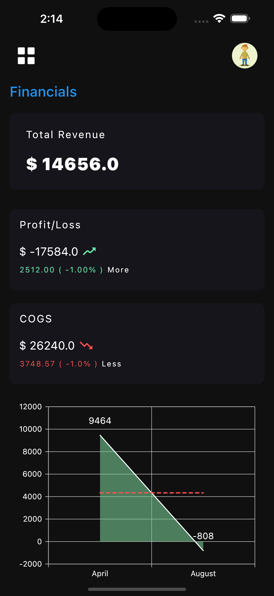

# FinBooks

FinBooks is an accounting and inventory management software. With FinBooks, you can create bills and payment vouchers. It smartly manages your inventory. Finbooks' smart algorithms manages your transactions effectively to generate financial reports. 

## Features

- Ledger Account balancing
- Bills and Voucher management
- Inventory management
- Financial reports

## Tech Stack

**Client:** Flutter

**Server:** Firebase

***Flutter packages used:***

- Adaptive Theme

    It helpes to manage and switching theme data.
- Sync Fusion Charts

    It offers very UI friendly charts. FinBooks' used various chart to show financial reports and data.
- FirebaseAuth / FirebaseCore / FirebaseDataBase

    These packages helps to interact with firebase services using API calls.

- Cached Network Images

    Network images are the images fetched using a URL. This package helps to cache these images to prevent repeated calls.
- Device Preview

    This package is to be used in development mode only. It helps to test the code on various devices without running on multiple emulators.

## Preview

 &nbsp; &nbsp;
 

## License

This project is licensed under the [GNU AFFERO GENERAL PUBLIC LICENSE Version 3](LICENSE).

## Contributing

Please read [Contribution Guide](CONTRIBUTING.md) for details on our code of conduct, and the process for submitting pull requests to us.
